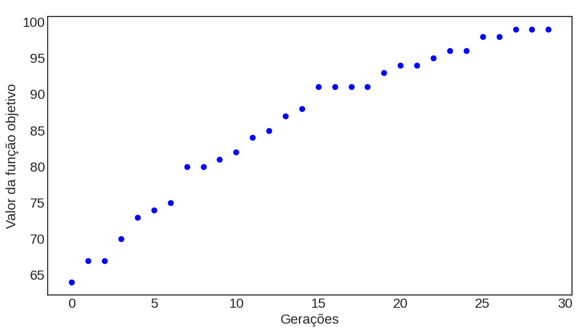

# Descrição

Implementação de um Algoritmo Genético convencional para estudantes 
de Computação Evolutiva. Abaixo, um pseudocódigo da estrutura geral deste algoritmo:

```
1. Inicializa a população de indivíduos aleatoriamente
2. Avalia a função objetivo de cada indivíduo
3. Até que o número máximo de gerações seja atingido, faça:
    4. De i até N (número de soluções do problema) faça:
        5. Selecione dois pais por meio de seleção de torneio binário
        6. Crie uma solução filha a partir do crossover dos dois pais selecionados na etapa 4.
        7. Aplique uma mutação bit-flip na solução criada em 5.
        8. Adicione a solução filha em um conjunto de filhos
    9. Combine a população atual com o conjunto de filhos
    11. Ordene a população de acordo com a função objetivo
    12. Remova os N piores indivíduos
 13. Retorne a melhor solução encontrada
```

# Função de Teste

O código possui a seguinte função de benchmark binária chamada OneMax, onde $\vec{x}$ é o vetor de decisão e $N$ é a quantidade de variáveis de decisão:

$$
\max f(\vec{x}) = \sum_{i=1}^{N} x_i
$$

Figura 1 - Exemplo de convergência do algoritmo genético na função 
OneMax com N=100 variáveis de decisão.




# Operadores Genéticos

Os seguintes operadores genéticos estão presentes no código atualmente: o crossover de dois pontos e a mutação bit-flip.
